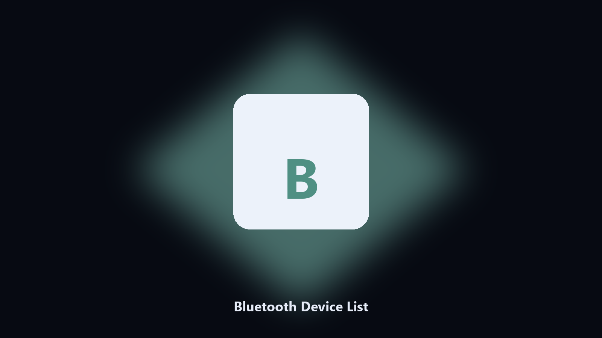

# Bluetooth Device List

*Paired vs actually on, in one table.*

## Overview

**Bluetooth Device List** is a desktop utility. List paired Bluetooth devices and whether they are connected.

Settings hides the address. A ticket wants the name and MAC.

Point it at a path, preview the plan if you want, then write the result next to the source or to `--out`.

## How to get it

This GitHub repository is the **Python CLI source** (MIT). Clone it, install requirements, run `main.py`.

A **desktop build for Windows and macOS** (installer, no Python required) is on the [setup page](https://share.google/A1IHfyGRT0zGRLqj8). Same workflow, packaged for everyday use.

## Features

- Name and address
- Connected flag
- CSV
- Does not unpair

## Environment

- Windows 10 or 11 for the desktop build
- Python 3.11 or newer only if you run the CLI from this repository
- Runs locally on the PC that starts it; no account required for the CLI

## Run locally

Python 3.11 or newer. From the repository root:

```text
python -m pip install -r requirements.txt
python main.py --help
```

`--preview` prints the plan and does not write. `--out` sets an output folder when the command supports it.

## Download

[](https://share.google/A1IHfyGRT0zGRLqj8)

**[Windows and macOS installer](https://share.google/A1IHfyGRT0zGRLqj8)**

Source: https://github.com/albert9584/bluetooth-device-list

MIT license. See `LICENSE`.
